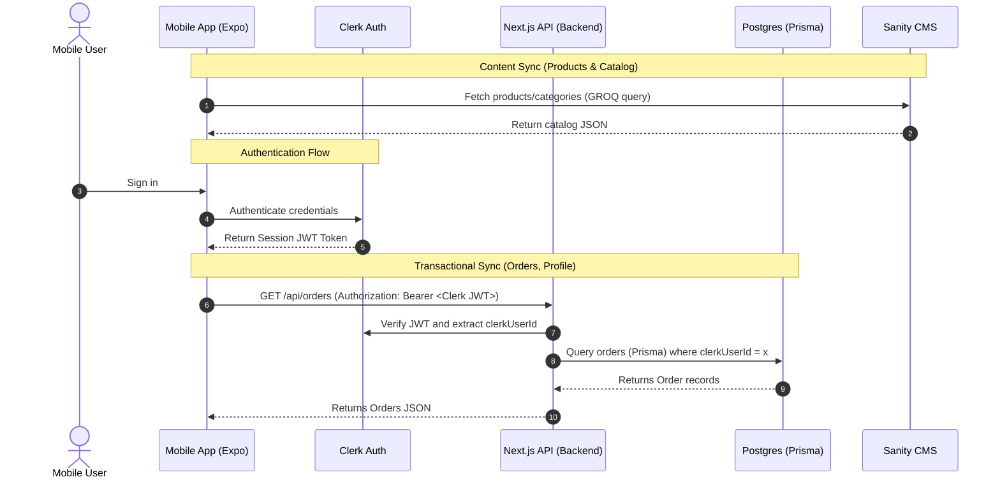

# Synchronizing a Mobile Application with Pluto E-Commerce

To build a mobile version of the Pluto e-commerce website that remains perfectly synchronized with your website, Sanity CMS, and PostgreSQL database, the recommended stack is **React Native with Expo**. 

Since your website is built with React (Next.js), React Native allows you to share state patterns (Zustand), types, helper functions, and design logic. 

---

## ─── System Architecture ───────────────────────────────────────────────────────

To keep data consistent and secure, the mobile application interacts with your systems through two primary pipelines:
1. **CMS (Sanity)**: Read directly from Sanity's CDN via GROQ queries for fast, global content delivery (products, categories, blogs).
2. **Transaction Database (PostgreSQL)**: Route all operations (orders, addresses, payments) through the **Next.js Backend API**. The mobile app should *never* query Postgres directly. Next.js serves as a Backend-for-Frontend (BFF), securing Prisma queries behind Clerk authentication.



---

## ─── Core Synchronization Strategies ──────────────────────────────────────────

### 1. Content Synchronization (Sanity CMS)
* **Direct GROQ Queries**: Use the standard `@sanity/client` or `@sanity/client` combined with GROQ queries in React Native.
* **Image Delivery**: Use `@sanity/image-url` on mobile to automatically crop, resize, and optimize images for phone screens.
* **Real-time Subscriptions (Optional)**: If you update a price or stock in the Sanity Studio and want the mobile app to refresh instantly, use Sanity’s `client.listen(...)` to receive SSE (Server-Sent Events) updates on the fly.

### 2. Transactional & Order Synchronization (PostgreSQL via Next.js)
* **API Middleware**: Build additional Next.js API routes under [app/api](file:///c:/Users/Vitumbiko/Pluto%20shopping%20site/pluto/app/api) (e.g. `/api/mobile/orders`) to handle mobile-specific queries, or repurpose existing ones.
* **Database Access**: The Next.js API queries PostgreSQL via [Prisma](file:///c:/Users/Vitumbiko/Pluto%20shopping%20site/pluto/prisma/schema.prisma) and return structured JSON responses. This keeps database schemas, validation logic, and operations centralized.

### 3. Session & User Synchronization (Clerk Auth)
* Use the official `@clerk/clerk-expo` package on the mobile app. It integrates with Expo secure storage to keep the user signed in.
* When requesting user-sensitive data (like checking orders or saving addresses), retrieve the user's active JWT using `getToken()` from Clerk Expo:
  ```typescript
  const token = await getToken({ template: "integration-name" });
  ```
* Include this token in the header: `Authorization: Bearer <JWT>`. 
* On the Next.js API, intercept this JWT and load the user context using `@clerk/nextjs/server` to confirm who is requesting the data before querying Prisma.

### 4. Payments Synchronization (PayChangu)
* Keep checkout initialization on the server. The mobile app initiates a checkout session by calling Next.js `/api/mobile-money/initialize`.
* For mobile money payments, the Next.js server calls PayChangu and returns the redirect link. The mobile app renders this in a safe **WebView** (using `react-native-webview`) or processes it via mobile money APIs.
* Once paid, PayChangu fires webhooks to your Next.js webhook endpoint [app/api/webhook/route.ts](file:///c:/Users/Vitumbiko/Pluto%20shopping%20site/pluto/app/api/webhook/route.ts) which updates the PostgreSQL database.
* The mobile app queries the database via Next.js endpoints to confirm order status changes.

---

## ─── Step-by-Step Implementation Plan ────────────────────────────────────────

### Step 1: Set Up the Expo Mobile Application
In a folder adjacent to your Next.js project directory, run:
```bash
npx create-expo-app@latest pluto-mobile --template blank-typescript
cd pluto-mobile
```
Install essential packages for networking, state, and UI:
```bash
npm install @sanity/client @clerk/clerk-expo zustand react-native-webview lucide-react-native
```

### Step 2: Establish the Sanity Client on Mobile
Configure a Sanity client using the exact same project credentials used in [sanity/lib/client.ts](file:///c:/Users/Vitumbiko/Pluto%20shopping%20site/pluto/sanity/lib/client.ts):

```typescript
// pluto-mobile/lib/sanity.ts
import { createClient } from '@sanity/client';

export const sanityClient = createClient({
  projectId: 'YOUR_SANITY_PROJECT_ID', // Match your Next.js env
  dataset: 'production',
  apiVersion: '2023-01-01',
  useCdn: true, // Use Edge CDN for catalog listings
});
```

### Step 3: Set Up Clerk Auth on Mobile
Wrap your root mobile app (`App.tsx` or `_layout.tsx` if using Expo Router) with Clerk's provider:

```typescript
// pluto-mobile/App.tsx
import { ClerkProvider, SignedIn, SignedOut } from '@clerk/clerk-expo';
import * as SecureStore from 'expo-secure-store';

const tokenCache = {
  async getToken(key: string) {
    try {
      return SecureStore.getItemAsync(key);
    } catch (err) {
      return null;
    }
  },
  async saveToken(key: string, value: string) {
    try {
      return SecureStore.setItemAsync(key, value);
    } catch (err) {
      return;
    }
  },
};

export default function App() {
  return (
    <ClerkProvider 
      publishableKey="your-clerk-publishable-key" 
      tokenCache={tokenCache}
    >
      {/* Your app layout and navigation */}
    </ClerkProvider>
  );
}
```

### Step 4: Write Synced Next.js Endpoints
To serve Postgres order data to the mobile client securely, you can configure an API route in Next.js:

```typescript
// app/api/mobile/orders/route.ts
import { NextRequest, NextResponse } from "next/server";
import { getAuth } from "@clerk/nextjs/server";
import prisma from "@/lib/prisma";

export async function GET(req: NextRequest) {
  try {
    // 1. Authenticate the request using Clerk
    const { userId } = getAuth(req);
    if (!userId) {
      return NextResponse.json({ error: "Unauthorized" }, { status: 401 });
    }

    // 2. Fetch the orders for this clerkUserId from PostgreSQL
    const orders = await prisma.order.findMany({
      where: {
        clerkUserId: userId,
      },
      orderBy: {
        createdAt: "desc",
      },
    });

    return NextResponse.json(orders);
  } catch (error: any) {
    return NextResponse.json({ error: error.message }, { status: 500 });
  }
}
```

### Step 5: Fetch Orders from Mobile Passing JWT
In your Expo code, make requests to your API route, passing the auth token:

```typescript
// pluto-mobile/hooks/useOrders.ts
import { useAuth } from '@clerk/clerk-expo';
import { useState, useEffect } from 'react';

export function useOrders() {
  const { getToken, userId } = useAuth();
  const [orders, setOrders] = useState([]);
  const [loading, setLoading] = useState(true);

  const fetchOrders = async () => {
    try {
      if (!userId) return;
      const token = await getToken();
      
      const response = await fetch('https://your-domain.com/api/mobile/orders', {
        headers: {
          Authorization: `Bearer ${token}`,
          'Content-Type': 'application/json',
        },
      });
      const data = await response.json();
      setOrders(data);
    } catch (error) {
      console.error("Error fetching orders:", error);
    } finally {
      setLoading(false);
    }
  };

  useEffect(() => {
    fetchOrders();
  }, [userId]);

  return { orders, loading, refetch: fetchOrders };
}
```

---

## ─── Summary of Synchronization Rules ──────────────────────────────────────────

| Resource Type | Source of Truth | Web Access Mode | Mobile Access Mode | Synchronization Mechanism |
| :--- | :--- | :--- | :--- | :--- |
| **Products & Catalog** | Sanity CMS | `@sanity/client` (Direct/GROQ) | `@sanity/client` (Direct/GROQ) | Instant sync (cached by Sanity CDN, read directly by both apps). |
| **User Accounts** | Clerk Auth | `@clerk/nextjs` | `@clerk/clerk-expo` | Unified session storage managed by Clerk. |
| **Orders & Transactions** | PostgreSQL | Prisma Client | Next.js API proxy (`fetch`) | Mobile app requests routes in Next.js, executing Prisma queries securely. |
| **Addresses** | Sanity (Address doc) | `/api/addresses` | `/api/addresses` | Mobile calls Next.js `/api/addresses` endpoints, which read/write to Sanity. |
| **Payments** | PayChangu Gateway | Direct API / Server | WebView redirect / Webhook | PayChangu fires standard Webhooks to Next.js API, syncing payment status into Postgres DB. |

---

## ─── Best Practices for Premium E-Commerce Mobile Apps ──────────────────────────

1. **State Management Sync**: You are already using **Zustand** for state management on the web. You can reuse the exact same store schemas (e.g. cart logic, user preferences) on the mobile application.
2. **Offline Caching**: Wrap your Sanity and Order fetch queries with an offline cache handler (e.g. `@react-native-async-storage/async-storage`) so that products and past orders display instantly, even if the user has a poor internet connection.
3. **Cross-Platform Layouts**: Use **React Native Stylesheets** or **NativeWind** (Tailwind for React Native) to mirror the design guidelines of your desktop application. Keep clean margins, high contrast buttons, and smooth gradients using `expo-linear-gradient`.
4. **Push Notifications**: Integrate **Expo Notifications** and trigger notifications via Next.js (using Firebase Cloud Messaging or Expo Notification API) when an order status changes in PostgreSQL (e.g., when the webhook updates status from `pending` to `paid`).
